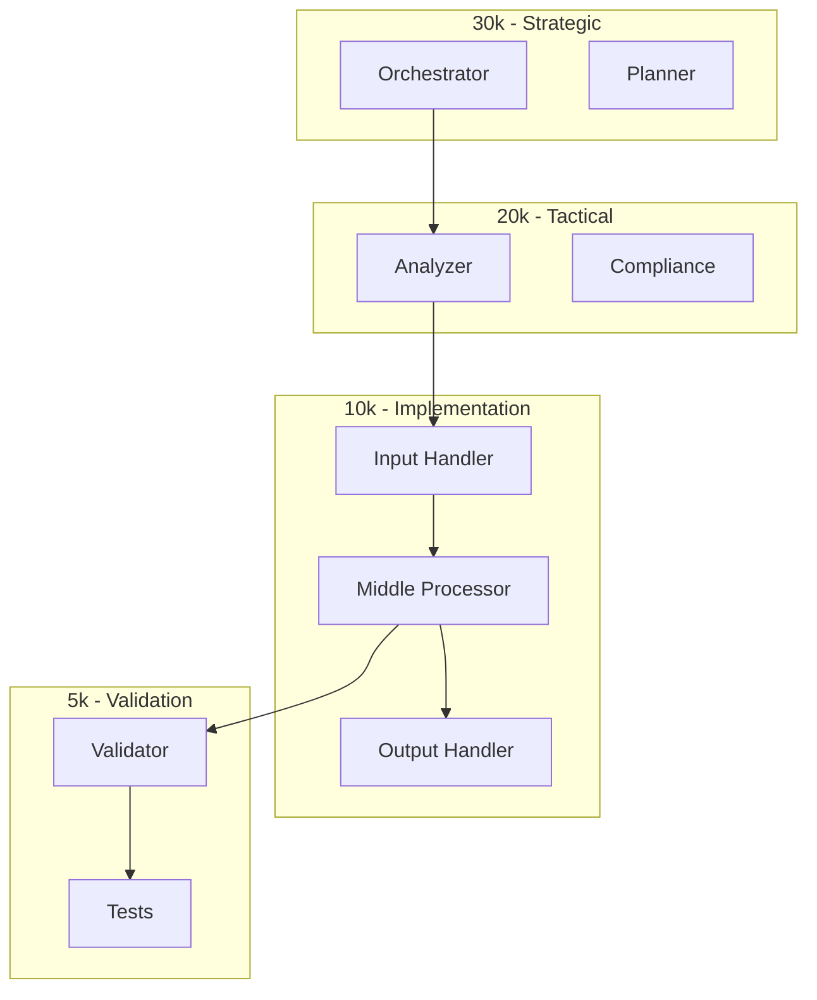

# Architecture Deep Dive

## System Overview


## Component Breakdown

### Input Layer [[../10-input/index.md|→]]
- Data ingestion
- Validation rules
- Schema enforcement
- Rate limiting

### Middle Layer [[../20-middle/index.md|→]]
- Business logic
- Transformation pipeline
- State management
- Cache strategy

### Output Layer [[../30-output/index.md|→]]
- Response formatting
- Delivery mechanisms
- Error handling
- Retry logic

## Data Flow
```yaml
input:
  source: API|Queue|File
  validation: schema|rules|contracts
  
middle:
  processing: sync|async|batch
  state: stateless|cached|persistent
  
output:
  format: JSON|XML|Binary
  delivery: HTTP|Queue|Stream
```

## Related
- [[api.md|API Design]]
- [[../40-agents/index.md|Agent System]]
- [[../50-environment/index.md|Environment Config]]