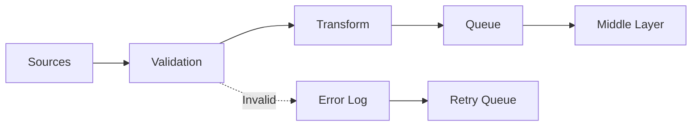

# Input Layer

## Overview
The input layer handles all data ingestion, validation, and initial processing.

## Components
- [[validation.md|Validation Engine]]
- [[schemas.md|Schema Definitions]]
- [[sources.md|Data Sources]]
- [[api.md|Input API]]

## Data Flow


## Supported Sources
1. **HTTP/REST**
   - JSON payloads
   - Form data
   - File uploads

2. **Message Queues**
   - Redis Queue
   - RabbitMQ
   - AWS SQS

3. **File System**
   - CSV imports
   - JSON files
   - Binary data

## Validation Rules
```yaml
input_validation:
  required_fields:
    - id
    - timestamp
    - data
  
  field_rules:
    id: 
      type: string
      pattern: "^[A-Z0-9-]+$"
    timestamp:
      type: datetime
      format: ISO8601
    data:
      type: object
      max_size: 10MB
```

## Configuration
See [[../50-environment/input-config.md|Input Configuration]]

## Error Handling
- [[../70-troubleshooting/input-errors.md|Common Input Errors]]
- [[validation.md#error-codes|Validation Error Codes]]

## Next: [[../20-middle/index.md|Middle Layer →]]