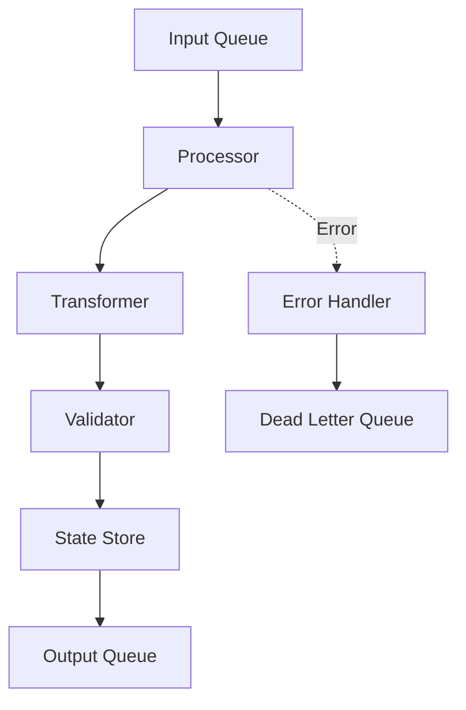

# Middle Layer

## Overview
Core business logic and processing engine.

## Components
- [[processing.md|Processing Engine]]
- [[state.md|State Management]]
- [[transforms.md|Data Transformations]]
- [[orchestration.md|Task Orchestration]]

## Architecture


## Processing Patterns
- **Synchronous**: Direct request/response
- **Asynchronous**: Queue-based processing
- **Batch**: Scheduled bulk operations
- **Stream**: Real-time data processing

## State Management
```yaml
state:
  type: redis|memory|database
  ttl: 3600
  persistence: true
  backup: s3
```

## Transformation Pipeline
1. Parse input data
2. Apply business rules
3. Transform to output format
4. Validate result
5. Store state

## Error Handling
- Retry with exponential backoff
- Circuit breaker for failing services
- Dead letter queue for unprocessable items

## Performance
- Target latency: <100ms
- Throughput: 1000 req/s
- Concurrent workers: 10

## Configuration
See [[../50-environment/middle-config.md|Middle Layer Configuration]]

## Related
- [[../10-input/index.md|← Input Layer]]
- [[../30-output/index.md|Output Layer →]]
- [[../40-agents/index.md|Agent System]]