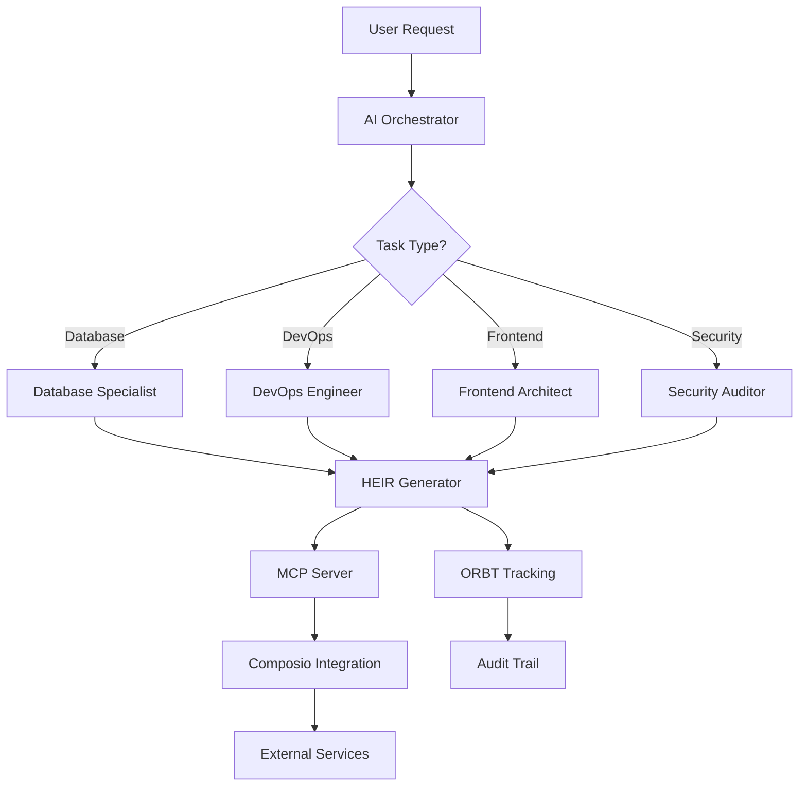

<!--

# CTB Metadata
# Generated: 2025-10-23T14:32:34.954398
# CTB Version: 1.3.3
# Division: AI Agents & MCP
# Category: README.md
# Compliance: 90%
# HEIR ID: HEIR-2025-10-AI-README-01

-->

# CTB/AI - AI Agents & MCP

**Division**: AI Agents & MCP Scripts
**Purpose**: AI orchestration, agent definitions, HEIR/ORBT utilities, and MCP integrations

---

## 📁 Directory Structure

```
ctb/ai/
├── agents/                 # Claude agent definitions
│   ├── agents/            # Individual agent markdown files
│   ├── mcp/               # MCP registry endpoints
│   └── manifest.json      # Agent manifest
├── orbt-utils/            # HEIR/ORBT tracking utilities
│   ├── heir-generator.js  # JavaScript HEIR ID generator
│   ├── heir_generator.py  # Python HEIR ID generator
│   └── README.md          # HEIR/ORBT documentation
├── mcp/                   # MCP-specific scripts
├── prompts/               # Prompt templates
└── blueprints/            # AI workflow blueprints
```

---

## 🤖 Agent Purpose

**AI Agents** in this division provide:
- Specialized Claude agents for different tasks
- MCP (Model Context Protocol) integrations
- HEIR/ORBT tracking for all operations
- Prompt engineering templates
- Workflow orchestration blueprints

---

## 🎯 Quick Start

### 1. Use HEIR/ORBT Generators

**JavaScript**:
```javascript
const HeirGenerator = require('./orbt-utils/heir-generator');

// Generate HEIR ID
const heirId = HeirGenerator.generateHeirId('IMO', 'CREATOR', 1);
// Result: HEIR-2025-10-IMO-CREATOR-01

// Generate Process ID
const processId = HeirGenerator.generateProcessId('IMO');
// Result: PRC-IMO-1729651200000

// Generate complete payload for Composio MCP
const payload = HeirGenerator.generatePayload(
    'apify_run_actor',
    { actorId: 'apify~leads-finder' },
    'IMO',
    'ACTION',
    2  // ORBT layer
);
```

**Python**:
```python
from orbt_utils.heir_generator import HeirGenerator

# Generate HEIR ID
heir_id = HeirGenerator.generate_heir_id('IMO', 'CREATOR', 1)
# Result: HEIR-2025-10-IMO-CREATOR-01

# Generate Process ID
process_id = HeirGenerator.generate_process_id('IMO')
# Result: PRC-IMO-1729651200000

# Generate complete payload
payload = HeirGenerator.generate_payload(
    'apify_run_actor',
    {'actorId': 'apify~leads-finder'},
    'IMO',
    'ACTION',
    2  # ORBT layer
)
```

### 2. Use Claude Agents

```bash
# Install agents
cd ctb/ai/agents
bash install.sh

# Agents will be available in .claude/agents/
```

**Available Agents**:
- `database-specialist.md` - Database operations and schema design
- `devops-engineer.md` - Infrastructure and deployment
- `frontend-architect.md` - UI/UX and component design
- `security-auditor.md` - Security scanning and compliance

---

## 🗺️ Orchestration Map



**Flow**:
1. User request comes in
2. AI Orchestrator determines task type
3. Specialized agent handles the task
4. HEIR ID generated for tracking
5. MCP server processes the request
6. Composio routes to appropriate service
7. ORBT tracking logs the operation
8. Audit trail maintained

---

## 📋 HEIR/ORBT System

### HEIR ID Format

```
HEIR-YYYY-MM-SYSTEM-MODE-VN
```

**Components**:
- `YYYY`: 4-digit year
- `MM`: 2-digit month (zero-padded)
- `SYSTEM`: System identifier (e.g., 'IMO', 'ACTION')
- `MODE`: Operation mode (e.g., 'CREATOR', 'VALIDATE')
- `VN`: 2-digit version number (zero-padded)

**Example**: `HEIR-2025-10-IMO-CREATOR-01`

### Process ID Format

```
PRC-SYSTEM-EPOCHTIMESTAMP
```

**Example**: `PRC-IMO-1729651200000`

### ORBT Layers

| Layer | Name | Description |
|-------|------|-------------|
| 1 | Input/Intake | Data ingestion and validation |
| 2 | Processing/Middle | Data transformation and enrichment |
| 3 | Output/Generation | Result creation and formatting |
| 4 | Orchestration | System-level coordination |

### Standard Payload Structure

All MCP calls must use this format:

```json
{
  "tool": "tool_name",
  "data": { "tool_specific": "data" },
  "unique_id": "HEIR-2025-10-IMO-ACTION-01",
  "process_id": "PRC-IMO-1729651200000",
  "orbt_layer": 2,
  "blueprint_version": "1.0"
}
```

---

## 🔧 Agent Configuration

### Agent Manifest (`agents/manifest.json`)

```json
{
  "version": "1.0",
  "agents": [
    {
      "id": "database-specialist",
      "name": "Database Specialist",
      "file": "agents/database-specialist.md",
      "expertise": ["sql", "migrations", "schemas"],
      "orbt_layer": 2
    }
  ]
}
```

### MCP Registry

Agents can register with the MCP server:

```bash
# Start MCP registry endpoint
python ctb/ai/agents/mcp/registry_endpoint.py
```

---

## 📚 Prompt Templates

**Location**: `ctb/ai/prompts/`

Common prompts:
- `system-initialization.md` - System setup prompts
- `task-orchestration.md` - Multi-step task prompts
- `error-recovery.md` - Error handling prompts

**Usage**:
```javascript
const promptTemplate = fs.readFileSync('ctb/ai/prompts/task-orchestration.md', 'utf8');
const prompt = promptTemplate.replace('{task}', userTask);
```

---

## 🎨 Workflow Blueprints

**Location**: `ctb/ai/blueprints/`

Blueprints define AI workflows:
- Input validation
- Processing steps
- Output formatting
- Error handling

**Example Blueprint**:
```yaml
name: Data Enrichment Workflow
version: 1.0
steps:
  - id: intake
    agent: database-specialist
    orbt_layer: 1
    action: validate_input
  - id: process
    agent: database-specialist
    orbt_layer: 2
    action: enrich_data
  - id: output
    agent: database-specialist
    orbt_layer: 3
    action: format_results
```

---

## 🧪 Testing

```bash
# Test HEIR generator (JavaScript)
node ctb/ai/orbt-utils/heir-generator.js

# Test HEIR generator (Python)
python ctb/ai/orbt-utils/heir_generator.py

# Validate agent manifest
python -c "import json; json.load(open('ctb/ai/agents/manifest.json'))"
```

---

## 📚 Related Documentation

- **HEIR/ORBT Guide**: `ctb/ai/orbt-utils/README.md`
- **Agent Installation**: `ctb/ai/agents/README.md` (if exists)
- **MCP Integration**: `ctb/docs/composio/COMPOSIO_INTEGRATION.md`
- **Global Manifest**: `ctb/docs/global-config/global_manifest.yaml`

---

## 🔗 Dependencies

**Depends On**:
- `ctb/sys/` - MCP server and API infrastructure

**Used By**:
- All divisions - HEIR/ORBT tracking required everywhere

---

## 💡 Best Practices

1. **Always Generate HEIR IDs**
   - Every operation should have a unique HEIR ID
   - Use appropriate SYSTEM and MODE identifiers

2. **Use Correct ORBT Layer**
   - Layer 1: Data intake/validation
   - Layer 2: Processing/transformation (most common)
   - Layer 3: Output/result generation
   - Layer 4: System orchestration

3. **Validate Payloads**
   - Use `validatePayload()` before sending to MCP
   - Ensure all required fields are present

4. **Log All Operations**
   - Log HEIR IDs for audit trails
   - Include Process IDs in logs

5. **Version Control**
   - Increment version numbers for retry attempts
   - Track blueprint versions

---

## 🚨 Common Issues

### Invalid HEIR ID Format

```bash
# Incorrect
HEIR-2025-1-SYS-TEST-1  # Month must be zero-padded

# Correct
HEIR-2025-01-SYS-TEST-01
```

### Missing ORBT Layer

```javascript
// Always specify ORBT layer
const payload = HeirGenerator.generatePayload(
    'tool',
    data,
    'SYS',
    'ACTION',
    2  // <-- Don't forget this!
);
```

---

**Last Updated**: 2025-10-23
**CTB Version**: 1.3.3
**Maintainer**: AI & Orchestration Team
