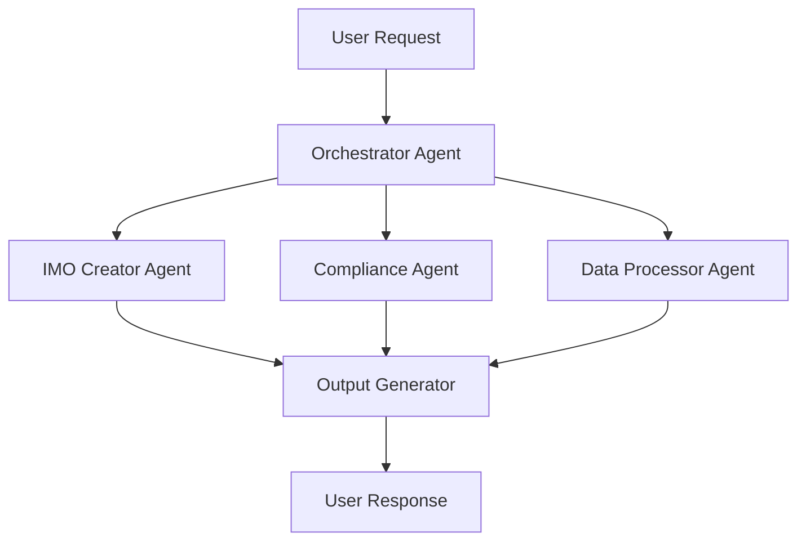

# CTB/AI - Artificial Intelligence Systems

**Purpose**: AI models, prompts, agent orchestration, training data, and ML workflows

---

## 📁 Directory Structure

```
ctb/ai/
├── models/                # AI model configurations
│   ├── gemini/           # Google Gemini models
│   ├── openai/           # OpenAI models
│   └── claude/           # Anthropic Claude models
├── prompts/              # Prompt templates & engineering
│   ├── system/           # System prompts
│   ├── user/             # User interaction prompts
│   └── templates/        # Reusable prompt templates
├── agents/               # AI agent configurations
│   ├── imo-creator/      # IMO creation agent
│   ├── compliance/       # Compliance checking agent
│   └── orchestrator/     # Multi-agent orchestrator
├── blueprints/           # AI system blueprints
│   ├── workflows/        # Agent workflow definitions
│   └── scenarios/        # Scenario configurations
├── training/             # Training data & fine-tuning
│   ├── datasets/         # Training datasets
│   ├── examples/         # Few-shot examples
│   └── evaluations/      # Model evaluation data
├── tools/                # AI-specific tools
│   ├── imo/              # IMO tool libraries
│   └── cli/              # CLI tools (e.g., gemini-cli)
└── tests/                # AI system tests
```

---

## 🎯 Agent Orchestration Map

### Primary Agents



### Agent Responsibilities

| Agent | Purpose | Input | Output |
|-------|---------|-------|--------|
| **Orchestrator** | Route requests to specialized agents | User query | Agent assignments |
| **IMO Creator** | Create marketing operations | IMO requirements | IMO definition |
| **Compliance** | Check CTB/HEIR compliance | Code/config | Compliance report |
| **Data Processor** | Process and transform data | Raw data | Structured data |
| **Output Generator** | Generate final outputs | Processed data | User-facing content |

---

## 🤖 AI Models

### Available Models

#### Google Gemini
**Config**: `models/gemini/config.json`

```json
{
  "models": {
    "gemini-2.5-flash": {
      "purpose": "Fast, efficient general-purpose",
      "context_window": 1000000,
      "use_cases": ["quick responses", "code generation", "summarization"]
    },
    "gemini-pro": {
      "purpose": "Advanced reasoning",
      "context_window": 32000,
      "use_cases": ["complex analysis", "multi-step reasoning"]
    },
    "gemini-pro-vision": {
      "purpose": "Multimodal (text + images)",
      "context_window": 16000,
      "use_cases": ["image analysis", "diagram interpretation"]
    }
  }
}
```

**Usage**:
```bash
# CLI tool
cd ctb/ai/tools/cli/gemini
node gemini.js generate "Explain quantum computing"

# Python SDK
from ctb.ai.models.gemini import GeminiClient

client = GeminiClient(api_key=os.getenv("GOOGLE_API_KEY"))
response = await client.generate("Your prompt here")
```

#### OpenAI
**Config**: `models/openai/config.json`

**Available Models**:
- `gpt-4-turbo` - Latest GPT-4
- `gpt-3.5-turbo` - Fast, cost-effective

**Usage**:
```python
from ctb.ai.models.openai import OpenAIClient

client = OpenAIClient(api_key=os.getenv("OPENAI_API_KEY"))
response = await client.chat_completion([
    {"role": "system", "content": "You are a helpful assistant."},
    {"role": "user", "content": "Hello!"}
])
```

---

## 📝 Prompt Engineering

### Prompt Templates

**Location**: `prompts/templates/`

**Structure**:
```
prompts/templates/
├── imo_creation.txt          # IMO creation prompt
├── compliance_check.txt      # Compliance checking
├── data_analysis.txt         # Data analysis
└── code_review.txt           # Code review
```

**Example Template**: `prompts/templates/imo_creation.txt`
```
# IMO Creation Template

## Context
You are an expert in creating Indexed Marketing Operations (IMOs).

## Task
Create an IMO based on the following requirements:
{requirements}

## Output Format
- IMO Name: [name]
- Description: [description]
- Components: [list]
- Metrics: [metrics]

## Constraints
- Must follow CTB structure
- Must include HEIR tracking
- Must be ORBT layer 2 compliant
```

**Usage**:
```python
from ctb.ai.prompts import load_template

template = load_template("imo_creation")
prompt = template.format(requirements="User requirements here")
response = await ai_client.generate(prompt)
```

---

## 🔄 Agent Workflows

### Example Workflow: IMO Creation

**File**: `blueprints/workflows/imo_creation.yaml`

```yaml
name: IMO Creation Workflow
version: 1.0.0
agents:
  - orchestrator
  - imo_creator
  - compliance_checker
  - output_generator

steps:
  - id: intake
    agent: orchestrator
    action: parse_user_request
    output: requirements

  - id: create
    agent: imo_creator
    action: generate_imo
    input: ${requirements}
    output: imo_draft

  - id: validate
    agent: compliance_checker
    action: check_compliance
    input: ${imo_draft}
    output: compliance_report

  - id: generate
    agent: output_generator
    action: format_output
    input:
      imo: ${imo_draft}
      compliance: ${compliance_report}
    output: final_imo
```

**Run Workflow**:
```bash
python ctb/ai/agents/orchestrator/run_workflow.py \
  --workflow imo_creation \
  --input "requirements.json"
```

---

## 🎓 Training Data

### Dataset Structure

**Location**: `training/datasets/`

```
training/datasets/
├── imo_examples/             # IMO creation examples
│   ├── valid/               # Valid IMO examples
│   ├── invalid/             # Invalid examples (for negative examples)
│   └── metadata.json        # Dataset metadata
├── compliance/              # Compliance examples
│   ├── compliant/          # Compliant code examples
│   ├── non_compliant/      # Non-compliant examples
│   └── annotations.json    # Annotations
└── code_analysis/          # Code analysis examples
```

### Adding Training Data

1. **Create dataset directory**:
   ```bash
   mkdir -p ctb/ai/training/datasets/my_dataset
   ```

2. **Add examples**:
   ```json
   {
     "examples": [
       {
         "input": "Create an IMO for...",
         "output": "IMO definition...",
         "metadata": {
           "quality": "high",
           "validated": true
         }
       }
     ]
   }
   ```

3. **Add metadata**:
   ```json
   {
     "dataset": "my_dataset",
     "version": "1.0.0",
     "size": 100,
     "purpose": "Fine-tuning for IMO creation"
   }
   ```

---

## 🧪 Testing AI Systems

### Run AI Tests
```bash
# Run all AI tests
pytest ctb/ai/tests/

# Run model tests
pytest ctb/ai/tests/test_models.py

# Run agent tests
pytest ctb/ai/tests/test_agents.py

# Run prompt tests
pytest ctb/ai/tests/test_prompts.py
```

### Test Coverage
```bash
pytest ctb/ai/tests/ --cov=ctb/ai --cov-report=html
```

---

## 📊 Common Tasks

### 1. Add New AI Model
1. Create config: `ctb/ai/models/your_model/config.json`
2. Add client: `ctb/ai/models/your_model/client.py`
3. Add tests: `ctb/ai/tests/test_your_model.py`
4. Update this README

### 2. Create New Prompt Template
1. Add template: `ctb/ai/prompts/templates/your_template.txt`
2. Add variables documentation
3. Test with actual data
4. Add to prompt library

### 3. Build New Agent
1. Define agent config: `ctb/ai/agents/your_agent/config.yaml`
2. Implement agent logic: `ctb/ai/agents/your_agent/agent.py`
3. Create workflow: `ctb/ai/blueprints/workflows/your_workflow.yaml`
4. Test agent behavior
5. Document in orchestration map

### 4. Fine-Tune Model
1. Prepare dataset: `ctb/ai/training/datasets/your_dataset/`
2. Create training script: `ctb/ai/training/train_your_model.py`
3. Run training
4. Evaluate performance
5. Deploy if metrics meet threshold

---

## 🔗 Dependencies

### External Services
- **Google Gemini API**: AI model access
- **OpenAI API**: GPT model access (optional)
- **Anthropic Claude API**: Claude model access (optional)

### Internal Dependencies
- `ctb/sys/` - API integrations (Composio)
- `ctb/data/` - Training datasets, model configs
- `ctb/meta/` - Configuration management

### Python Packages
```bash
pip install openai google-generativeai anthropic langchain
```

---

## 🔐 Environment Variables

```bash
# Google Gemini
GOOGLE_API_KEY=AIzaSy...
GEMINI_MODEL=gemini-2.5-flash

# OpenAI (optional)
OPENAI_API_KEY=sk-...
OPENAI_MODEL=gpt-4-turbo

# Anthropic Claude (optional)
ANTHROPIC_API_KEY=sk-ant-...
CLAUDE_MODEL=claude-3-sonnet
```

---

## 📚 Documentation

- **Prompt Engineering Guide**: `prompts/PROMPT_ENGINEERING.md`
- **Agent Development**: `agents/AGENT_DEVELOPMENT.md`
- **Model Comparison**: `models/MODEL_COMPARISON.md`
- **Training Guide**: `training/TRAINING_GUIDE.md`

---

## 🎯 Best Practices

### Prompt Engineering
- **Be specific**: Clear, detailed instructions
- **Use examples**: Few-shot learning improves accuracy
- **Set constraints**: Define output format and limitations
- **Test iteratively**: Refine prompts based on outputs

### Agent Design
- **Single responsibility**: Each agent has one clear purpose
- **Stateless when possible**: Avoid agent state dependencies
- **Error handling**: Graceful degradation on failures
- **Logging**: Track agent decisions and outputs

### Model Selection
- **Use Gemini Flash** for quick, cost-effective tasks
- **Use GPT-4** for complex reasoning
- **Use Claude** for long-context analysis
- **Benchmark** performance on your specific use case

---

## 🚨 Important Notes

### Rate Limits
- **Gemini**: Check quota at https://makersuite.google.com
- **OpenAI**: Track usage at https://platform.openai.com/usage
- **Implement exponential backoff** for rate limit errors

### Cost Management
- **Monitor API usage** regularly
- **Use caching** for repeated prompts
- **Choose appropriate models** (Flash vs Pro)
- **Set budget alerts**

### Security
- **Never log API keys**
- **Sanitize user inputs** before sending to models
- **Validate model outputs** before executing
- **Implement content filtering** for sensitive data

---

## 🆘 Troubleshooting

### Model API Errors
```bash
# Check API key
echo $GOOGLE_API_KEY

# Test connection
curl https://generativelanguage.googleapis.com/v1beta/models/gemini-pro:generateContent \
  -H "x-goog-api-key: $GOOGLE_API_KEY"

# View error logs
tail -f logs/ai_errors.log
```

### Poor Model Outputs
1. **Refine prompt**: Add more context/examples
2. **Adjust temperature**: Lower for deterministic, higher for creative
3. **Try different model**: Some tasks suit specific models
4. **Review training data**: Ensure high-quality examples

### Agent Failures
1. **Check agent logs**: `logs/agent_orchestrator.log`
2. **Verify workflow config**: YAML syntax correct?
3. **Test individual agents**: Isolate the failing agent
4. **Review dependencies**: Are required services running?

---

## 📞 Support

- **Model Issues**: See model-specific README in `models/`
- **Prompt Help**: See `prompts/PROMPT_ENGINEERING.md`
- **Agent Issues**: See `agents/AGENT_DEVELOPMENT.md`
- **General Help**: See `ENTRYPOINT.md` at repo root

---

**Branch**: ai
**Maintainer**: AI/ML Team
**Last Updated**: 2025-10-23
