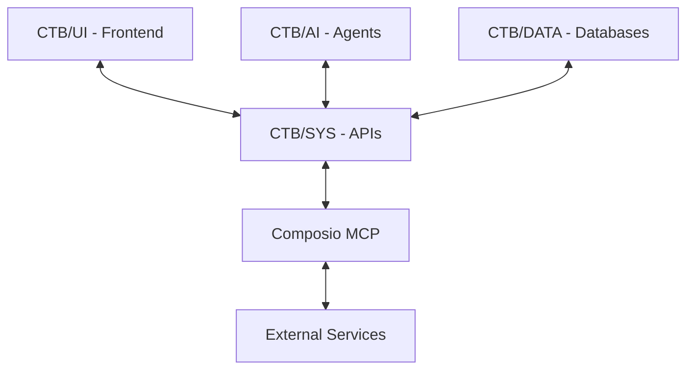

# CTB/DOCS - Documentation & Guides

**Division**: Documentation & Guides (20k Altitude)
**Purpose**: Architecture diagrams, API specs, guides, and reference documentation

---

## 📁 Directory Structure

```
ctb/docs/
├── guides/              # Developer guides
│   ├── blueprints/     # Workflow blueprints
│   ├── docs/           # Architecture documentation
│   └── tutorials/      # Step-by-step tutorials
├── api/                 # API documentation
│   ├── openapi/        # OpenAPI/Swagger specs
│   └── endpoints/      # Endpoint documentation
├── architecture/        # Architecture diagrams
│   └── architecture.mmd # Mermaid system diagram
├── composio/            # Composio integration docs
│   ├── COMPOSIO_INTEGRATION.md
│   └── COMPOSIO_MCP_INTEGRATION.md
├── barton/              # Barton Doctrine documentation
│   └── BARTON_OUTREACH_CORE_UPDATES.md
└── diagrams/            # Visual diagrams
    ├── data-flow.mmd   # Data flow diagrams
    └── api-flow.mmd    # API flow diagrams
```

---

## 🚀 Quick Start

### 1. View System Architecture

```bash
# View main architecture diagram
cat ctb/docs/architecture/architecture.mmd

# Or use VS Code Mermaid extension
code ctb/docs/architecture/architecture.mmd
```

### 2. Read Integration Guides

```bash
# Composio MCP integration (CRITICAL)
cat ctb/docs/composio/COMPOSIO_INTEGRATION.md

# Barton Doctrine updates
cat ctb/docs/barton/BARTON_OUTREACH_CORE_UPDATES.md
```

### 3. Explore Blueprints

```bash
# List available workflow blueprints
ls ctb/docs/guides/blueprints/

# Read a specific blueprint
cat ctb/docs/guides/blueprints/gmail_outreach.yaml
```

---

## 📖 Key Documentation Files

### Architecture

**`architecture/architecture.mmd`**
- Full system architecture diagram
- Shows data flow: Data ↔ AI ↔ UI ↔ External Services
- CTB division interactions
- MCP server integration points

### Composio Integration

**`composio/COMPOSIO_INTEGRATION.md`** (CRITICAL)
- Complete Composio MCP setup guide
- Connected account IDs for all services
- HEIR/ORBT payload format examples
- Working curl commands for all integrations

**`composio/COMPOSIO_MCP_INTEGRATION.md`**
- Advanced MCP patterns
- Custom tool creation
- Composio workflow automation

### Barton Doctrine

**`barton/BARTON_OUTREACH_CORE_UPDATES.md`**
- HEIR/ORBT system documentation
- Process ID generation rules
- CTB structure compliance
- Database connection patterns

### Blueprints

**`guides/blueprints/*.yaml`**
- Workflow automation blueprints
- Agent orchestration patterns
- API integration templates

---

## 🔍 Finding Documentation

### By Topic

```bash
# Search for specific topics
grep -r "HEIR" ctb/docs/
grep -r "Composio" ctb/docs/
grep -r "database" ctb/docs/

# Find all Mermaid diagrams
find ctb/docs/ -name "*.mmd"

# Find all YAML blueprints
find ctb/docs/guides/blueprints/ -name "*.yaml"
```

### By Type

- **Architecture**: `ctb/docs/architecture/`
- **API Specs**: `ctb/docs/api/openapi/`
- **Guides**: `ctb/docs/guides/docs/`
- **Tutorials**: `ctb/docs/guides/tutorials/`
- **Diagrams**: `ctb/docs/diagrams/` and `ctb/docs/architecture/`

---

## 📊 Diagrams

### Mermaid Diagrams

All diagrams use Mermaid syntax for easy rendering in VS Code, GitHub, and documentation tools.

**Main Architecture** (`architecture/architecture.mmd`):


**Viewing Options**:
1. VS Code with Mermaid extension
2. GitHub (auto-renders .mmd files)
3. Online: https://mermaid.live
4. CLI: `mmdc -i diagram.mmd -o diagram.png`

---

## 🛠️ Creating New Documentation

### Adding a Guide

```bash
# Create new guide
touch ctb/docs/guides/docs/my_new_guide.md

# Follow template structure:
# 1. Title & Purpose
# 2. Prerequisites
# 3. Step-by-step instructions
# 4. Code examples
# 5. Troubleshooting
# 6. Related docs
```

### Adding a Diagram

```bash
# Create Mermaid diagram
touch ctb/docs/diagrams/my_flow.mmd

# Use Mermaid syntax
# Reference: https://mermaid.js.org/syntax/
```

### Adding a Blueprint

```bash
# Create YAML blueprint
touch ctb/docs/guides/blueprints/my_workflow.yaml

# Include:
# - name, description, version
# - steps with HEIR tracking
# - error handling
# - expected outputs
```

---

## 📝 Documentation Standards

### Markdown Files

- Use GitHub-flavored markdown
- Include code blocks with language tags
- Add table of contents for long docs
- Use relative links to other docs
- Include "Last Updated" date

### Diagrams

- Use Mermaid for all diagrams
- Keep diagrams focused (one concept per diagram)
- Add comments in diagram code
- Export PNG versions for presentations

### Code Examples

- Always include working examples
- Add comments explaining key parts
- Show error handling
- Include expected output

---

## 🔗 Related Documentation

### External Links

- **Composio Docs**: https://docs.composio.dev
- **MCP Specification**: https://modelcontextprotocol.io
- **Mermaid Syntax**: https://mermaid.js.org
- **OpenAPI Spec**: https://swagger.io/specification/

### Internal References

- **CTB Structure**: `ctb/sys/global-factory/CTB_DOCTRINE.md`
- **Global Manifest**: `ctb/sys/global-factory/global_manifest.yaml`
- **Dependencies**: `ctb/meta/DEPENDENCIES.md`
- **Entry Point**: `ENTRYPOINT.md` (root)

---

## 🗂️ Documentation Categories

### 1. Getting Started
- Installation guides
- Quick start tutorials
- Environment setup

### 2. Architecture
- System design
- Data flow diagrams
- Component interactions
- CTB structure overview

### 3. Integration Guides
- Composio MCP setup
- Google Workspace integration
- Database connections
- External service APIs

### 4. API Reference
- REST API endpoints
- MCP tool definitions
- Request/response formats
- Authentication patterns

### 5. Workflow Blueprints
- Agent orchestration
- Multi-step processes
- Error handling patterns
- HEIR/ORBT tracking

### 6. Advanced Topics
- Custom tool creation
- Performance optimization
- Security best practices
- Deployment strategies

---

## 🚨 Critical Documentation

**MUST READ** before starting development:

1. **`COMPOSIO_INTEGRATION.md`** - All external service integrations
2. **`BARTON_OUTREACH_CORE_UPDATES.md`** - HEIR/ORBT and database patterns
3. **`architecture/architecture.mmd`** - System architecture
4. **`ENTRYPOINT.md`** (root) - Repository navigation

---

## 📚 Documentation Maintenance

### Updating Docs

```bash
# When code changes, update related docs
# Check for outdated examples
# Update version numbers
# Refresh diagrams if architecture changes
```

### Generating API Docs

```bash
# Auto-generate OpenAPI spec from FastAPI
python -c "import json; from ctb.sys.server.main import app; print(json.dumps(app.openapi(), indent=2))" > ctb/docs/api/openapi/api-spec.json
```

### Diagram Updates

```bash
# When CTB structure changes
# Update architecture.mmd
# Regenerate data flow diagrams
# Update component interaction diagrams
```

---

## 🔍 Search & Navigation

### Quick Find

```bash
# Find documentation by keyword
find ctb/docs/ -name "*.md" -exec grep -l "keyword" {} \;

# Search within Composio docs
grep -r "Gmail" ctb/docs/composio/

# Find all blueprint files
ls ctb/docs/guides/blueprints/*.yaml
```

### Browse by Category

- **Setup Guides**: `ctb/docs/guides/docs/`
- **API Specs**: `ctb/docs/api/`
- **Diagrams**: `ctb/docs/architecture/` + `ctb/docs/diagrams/`
- **Integrations**: `ctb/docs/composio/` + `ctb/docs/barton/`

---

## 🧪 Example Use Cases

### For New Developers

1. Read `ENTRYPOINT.md` (root)
2. Review `architecture/architecture.mmd`
3. Read `COMPOSIO_INTEGRATION.md`
4. Explore relevant blueprints

### For API Integration

1. Read `composio/COMPOSIO_INTEGRATION.md`
2. Check `api/openapi/api-spec.json`
3. Review working curl examples
4. Test with MCP server

### For Architecture Changes

1. Review `architecture/architecture.mmd`
2. Check `DEPENDENCIES.md`
3. Update affected diagrams
4. Document new patterns

---

**Last Updated**: 2025-10-23
**CTB Version**: 1.3.3
**Maintainer**: Documentation Team
