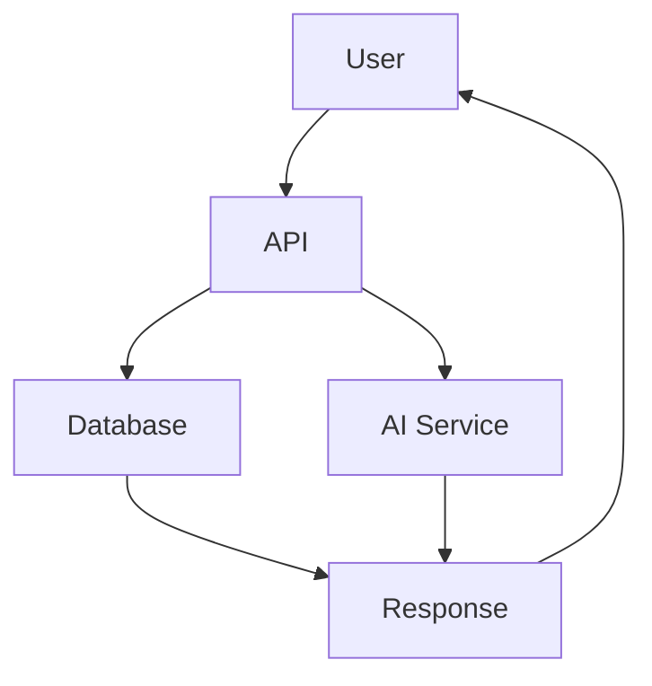

# CTB/DOCS - Documentation

**Purpose**: Technical documentation, guides, API references, architecture diagrams, and knowledge base

---

## 📁 Directory Structure

```
ctb/docs/
├── ctb/                      # CTB system documentation
│   ├── CTB_GUIDE.md         # Complete CTB guide
│   ├── CTB_STANDARDS.md     # CTB standards and conventions
│   └── COMPLIANCE.md        # Compliance requirements
├── doctrine/                 # Barton Doctrine documents
│   ├── BARTON_DOCTRINE.md   # Core doctrine
│   ├── HEIR_ORBT_SPEC.md    # HEIR/ORBT specification
│   └── INTEGRATION_STANDARDS.md
├── api/                      # API documentation
│   ├── REST_API.md          # REST API reference
│   ├── COMPOSIO_API.md      # Composio integration API
│   ├── endpoints/           # Endpoint documentation
│   └── examples/            # API usage examples
├── architecture/             # Architecture documentation
│   ├── ARCHITECTURE.md      # System architecture overview
│   ├── architecture.mmd     # Mermaid diagram (data ↔ AI ↔ UI)
│   ├── DATABASE_DESIGN.md   # Database architecture
│   └── diagrams/            # Architecture diagrams
├── guides/                   # User and developer guides
│   ├── QUICKSTART.md        # Quick start guide
│   ├── DEVELOPMENT.md       # Development guide
│   ├── DEPLOYMENT.md        # Deployment guide
│   └── TROUBLESHOOTING.md   # Troubleshooting guide
├── integrations/             # Integration documentation
│   ├── COMPOSIO.md          # Composio integration
│   ├── FIREBASE.md          # Firebase integration
│   ├── NEON.md              # Neon database
│   └── GITHUB.md            # GitHub integration
├── ort/                      # Operational Reference Templates
│   ├── ort_template.md      # ORT template
│   └── examples/            # ORT examples
└── sops/                     # Standard Operating Procedures
    ├── DEPLOYMENT_SOP.md    # Deployment procedures
    ├── INCIDENT_RESPONSE.md # Incident response
    └── MAINTENANCE_SOP.md   # Maintenance procedures
```

---

## 📖 Documentation Map

### 🚀 Getting Started

**New to the project?** Start here:

1. **`ENTRYPOINT.md`** (repo root) - Project overview and quick navigation
2. **`guides/QUICKSTART.md`** - Get up and running in 5 minutes
3. **`architecture/ARCHITECTURE.md`** - Understand system architecture
4. **`api/REST_API.md`** - API reference

### 🏗️ Architecture & Design

**Understanding the system:**

- **`architecture/architecture.mmd`** - Visual system diagram (Mermaid)
- **`architecture/ARCHITECTURE.md`** - Detailed architecture documentation
- **`architecture/DATABASE_DESIGN.md`** - Database schema and design
- **`architecture/diagrams/`** - Additional diagrams

**Key Diagrams**:
```
docs/architecture/diagrams/
├── system_overview.png       # High-level system diagram
├── data_flow.png            # Data flow diagram
├── integration_map.png      # External integrations
└── deployment_diagram.png   # Deployment architecture
```

### 📘 CTB System

**Christmas Tree Backbone documentation:**

- **`ctb/CTB_GUIDE.md`** - Complete CTB guide
- **`ctb/CTB_STANDARDS.md`** - Standards and conventions
- **`ctb/COMPLIANCE.md`** - Compliance requirements and scoring

**CTB Structure**:
```
ctb/
├── sys/    # System integrations
├── ai/     # AI models and agents
├── data/   # Database schemas
├── docs/   # Documentation (you are here)
├── ui/     # User interfaces
└── meta/   # Configuration
```

### 🔌 Integration Guides

**Connecting external services:**

- **`integrations/COMPOSIO.md`** - Composio MCP server (100+ services)
- **`integrations/FIREBASE.md`** - Firebase/Firestore setup
- **`integrations/NEON.md`** - Neon PostgreSQL database
- **`integrations/GITHUB.md`** - GitHub automation

### 🎯 API Documentation

**REST API references:**

- **`api/REST_API.md`** - Complete REST API documentation
- **`api/COMPOSIO_API.md`** - Composio-specific endpoints
- **`api/endpoints/`** - Individual endpoint documentation
- **`api/examples/`** - Code examples and curl commands

**API Endpoint Map**:
```
/api/
├── /health                  # Health check
├── /composio/*             # Composio tool execution
├── /neon/*                 # Database operations
├── /ctb/*                  # CTB compliance endpoints
└── /firebase/*             # Firebase operations
```

### 📚 Doctrine Documentation

**Barton Doctrine standards:**

- **`doctrine/BARTON_DOCTRINE.md`** - Core principles and standards
- **`doctrine/HEIR_ORBT_SPEC.md`** - HEIR/ORBT payload specification
- **`doctrine/INTEGRATION_STANDARDS.md`** - Integration guidelines

**Key Concepts**:
- **HEIR ID Format**: `HEIR-YYYY-MM-SYSTEM-MODE-VN`
- **Process ID Format**: `PRC-SYSTEM-EPOCHTIMESTAMP`
- **ORBT Layers**: 1 (Infrastructure), 2 (Integration), 3 (Application), 4 (Presentation)

### 🛠️ Developer Guides

**For developers:**

- **`guides/DEVELOPMENT.md`** - Development workflow
- **`guides/DEPLOYMENT.md`** - Deployment procedures
- **`guides/TROUBLESHOOTING.md`** - Common issues and solutions
- **`guides/TESTING.md`** - Testing guidelines

### 📋 Standard Operating Procedures

**SOPs for operations:**

- **`sops/DEPLOYMENT_SOP.md`** - Standard deployment process
- **`sops/INCIDENT_RESPONSE.md`** - Incident response procedures
- **`sops/MAINTENANCE_SOP.md`** - Regular maintenance tasks

---

## 🔍 Finding Documentation

### By Topic

| Topic | Document | Location |
|-------|----------|----------|
| **Getting Started** | Quick Start | `guides/QUICKSTART.md` |
| **System Architecture** | Architecture Overview | `architecture/ARCHITECTURE.md` |
| **System Diagram** | Mermaid Diagram | `architecture/architecture.mmd` |
| **API Reference** | REST API | `api/REST_API.md` |
| **CTB Structure** | CTB Guide | `ctb/CTB_GUIDE.md` |
| **Database Design** | Database Design | `architecture/DATABASE_DESIGN.md` |
| **Composio Integration** | Composio Guide | `integrations/COMPOSIO.md` |
| **HEIR/ORBT Spec** | HEIR/ORBT Specification | `doctrine/HEIR_ORBT_SPEC.md` |
| **Deployment** | Deployment Guide | `guides/DEPLOYMENT.md` |
| **Troubleshooting** | Troubleshooting Guide | `guides/TROUBLESHOOTING.md` |

### By Role

**For New Developers**:
1. `ENTRYPOINT.md` (repo root)
2. `guides/QUICKSTART.md`
3. `guides/DEVELOPMENT.md`
4. `architecture/architecture.mmd`

**For DevOps**:
1. `guides/DEPLOYMENT.md`
2. `sops/DEPLOYMENT_SOP.md`
3. `architecture/ARCHITECTURE.md`
4. `sops/MAINTENANCE_SOP.md`

**For API Consumers**:
1. `api/REST_API.md`
2. `api/COMPOSIO_API.md`
3. `api/examples/`
4. `doctrine/HEIR_ORBT_SPEC.md`

**For Data Engineers**:
1. `architecture/DATABASE_DESIGN.md`
2. `ctb/data/README.md` (in data branch)
3. `integrations/NEON.md`
4. `integrations/FIREBASE.md`

**For AI/ML Engineers**:
1. `ctb/ai/README.md` (in ai branch)
2. `architecture/architecture.mmd`
3. `api/REST_API.md`

---

## 📊 Documentation Standards

### Writing Documentation

**Format**: Markdown (`.md`)

**Structure**:
```markdown
# Title

**Purpose**: Brief description

---

## Section 1

Content...

## Section 2

Content...

---

**Last Updated**: YYYY-MM-DD
**Maintainer**: Team Name
```

**Best Practices**:
- ✅ Use clear, concise language
- ✅ Include code examples
- ✅ Add diagrams where helpful
- ✅ Keep table of contents for long docs
- ✅ Update "Last Updated" date
- ✅ Link to related documentation

### Diagram Standards

**Preferred Format**: Mermaid (`.mmd`)

**Why Mermaid?**
- Text-based (version control friendly)
- Renders in GitHub/GitLab
- Easy to update
- Consistent styling

**Example**:


**Alternative Formats**:
- PNG/SVG for complex diagrams
- draw.io XML (keep source files)
- PlantUML for sequence diagrams

---

## 🔄 Keeping Documentation Updated

### When to Update

**Always update documentation when**:
- ✅ Adding new features
- ✅ Changing APIs
- ✅ Modifying architecture
- ✅ Fixing bugs that affect docs
- ✅ Adding/removing dependencies

### Documentation Review Checklist

```markdown
- [ ] Accuracy: All information is correct
- [ ] Completeness: No missing steps or information
- [ ] Clarity: Easy to understand
- [ ] Code examples: All examples work
- [ ] Links: All internal links are valid
- [ ] Date: "Last Updated" is current
- [ ] Related docs: Cross-references updated
```

### Monthly Documentation Audit

**First Monday of each month**:
1. Review all documentation
2. Test code examples
3. Update outdated sections
4. Fix broken links
5. Add missing documentation
6. Archive deprecated docs

---

## 🆘 Documentation Issues

### Can't Find What You Need?

1. **Check**: `ENTRYPOINT.md` at repo root
2. **Search**: Use GitHub/GitLab search for keywords
3. **Ask**: Create an issue with label `documentation`
4. **Request**: Open PR to add missing docs

### Found Outdated Documentation?

1. **Create Issue**: Tag with `documentation` + `outdated`
2. **Update It**: Open PR with corrections
3. **Notify Team**: Mention in team chat

### Suggest New Documentation?

1. **Check**: Does it already exist elsewhere?
2. **Create Issue**: Describe what's needed
3. **Draft PR**: Write the documentation
4. **Request Review**: Get team feedback

---

## 📁 Documentation Templates

**Available in**: `docs/templates/`

- `API_ENDPOINT_TEMPLATE.md` - For API endpoint docs
- `INTEGRATION_TEMPLATE.md` - For integration guides
- `FEATURE_TEMPLATE.md` - For feature documentation
- `SOP_TEMPLATE.md` - For standard operating procedures

---

## 🔗 External Resources

### Official Documentation

- **Composio**: https://docs.composio.dev
- **Firebase**: https://firebase.google.com/docs
- **Neon**: https://neon.tech/docs
- **Mermaid**: https://mermaid.js.org

### Related Projects

- **Barton Outreach Core**: See barton-outreach-core repo
- **CTB Factory**: See ctb-factory repo

---

## 📞 Support

- **Documentation Issues**: Create issue with `documentation` label
- **General Help**: See `ENTRYPOINT.md` at repo root
- **API Questions**: See `api/REST_API.md`
- **Architecture Questions**: See `architecture/ARCHITECTURE.md`

---

## 🎯 Quick Links

| Document | Purpose |
|----------|---------|
| [ENTRYPOINT.md](../../ENTRYPOINT.md) | Project entry point |
| [architecture.mmd](architecture/architecture.mmd) | System diagram |
| [REST_API.md](api/REST_API.md) | API reference |
| [CTB_GUIDE.md](ctb/CTB_GUIDE.md) | CTB structure guide |
| [QUICKSTART.md](guides/QUICKSTART.md) | Quick start |
| [DEVELOPMENT.md](guides/DEVELOPMENT.md) | Development guide |

---

**Branch**: docs
**Maintainer**: Documentation Team
**Last Updated**: 2025-10-23

---

## 📝 Contributing to Documentation

### How to Contribute

1. **Fork** or **branch** from master
2. **Edit** documentation files
3. **Test** code examples
4. **Preview** markdown rendering
5. **Submit** pull request
6. **Respond** to review feedback

### Documentation Standards

- Use Markdown format
- Follow existing structure
- Include code examples
- Add diagrams where helpful
- Update "Last Updated" date
- Test all commands/examples
- Link to related docs

---

**Need help?** See `ENTRYPOINT.md` or create an issue!
