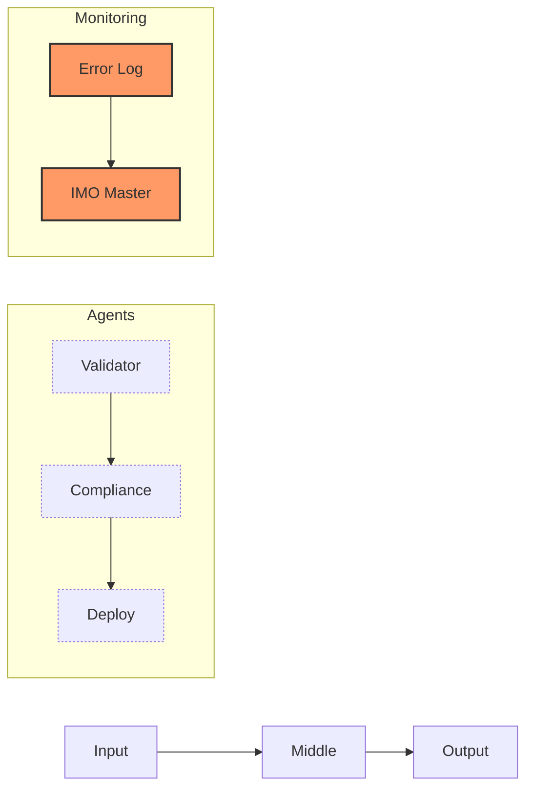

# Overview

## Application Details
- **App**: {{APP_NAME}}
- **Version**: {{VERSION}}
- **Dashboard**: {{DASHBOARD_URL}}
- **Status**: {{STATUS_URL}}

## Core Contracts
- `/health` - Health check endpoint
- `/version` - Version information
- `/heir/status` - HEIR system status
- `/api/v1/*` - Main API routes

## Architecture

## Error Pipeline
- **Type**: Write-only
- **Destination**: IMO master_error_log
- **Format**: JSON structured logs
- **Keys**: `IMO_MASTER_ERROR_ENDPOINT`, `IMO_ERROR_API_KEY`

## Quick Start
1. [[../50-environment/setup.md|Environment Setup]]
2. [[../60-operations/deployment.md|Deploy Application]]
3. [[../10-input/validation.md|Configure Input]]
4. [[../70-troubleshooting/common-issues.md|Troubleshooting]]

## Related Pages
- [[architecture.md|Architecture Deep Dive]]
- [[api.md|API Reference]]
- [[metrics.md|Metrics & Monitoring]]
- [[compliance.md|Compliance Status]]