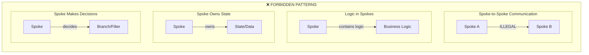
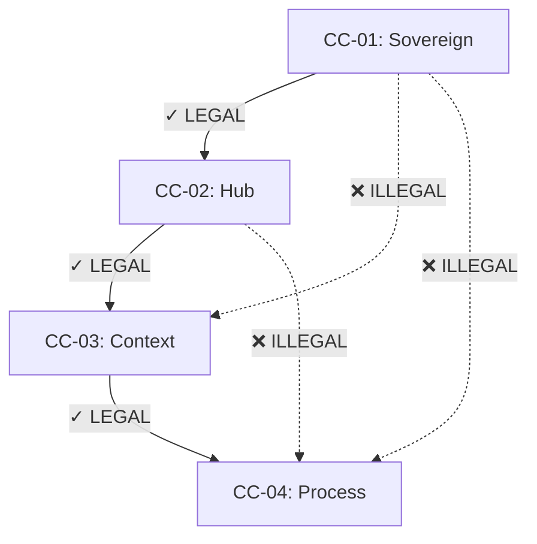
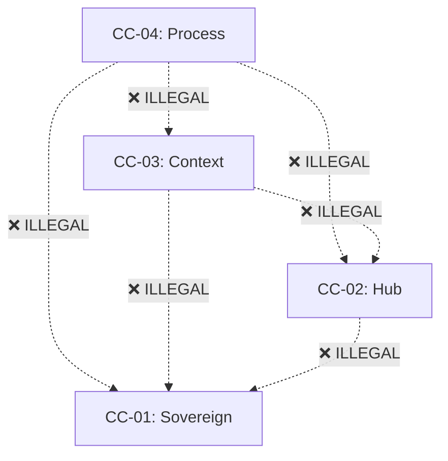
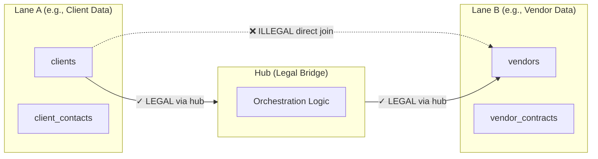
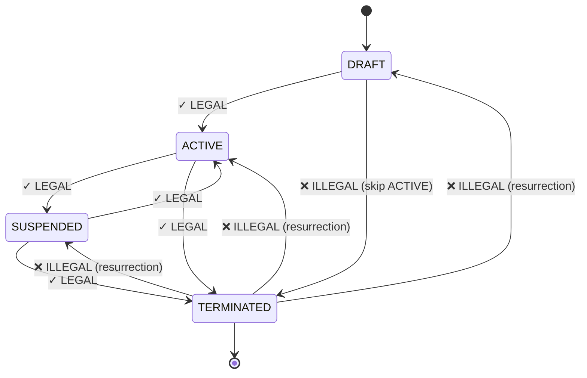

# TAS — Anti-Patterns (Negative Diagrams)

**Generated**: 2026-01-28
**Authority**: IMO-Creator (CC-01 Sovereign)
**Status**: AUTHORITATIVE

---

## Purpose

This document explicitly defines **what must NEVER happen**. These are forbidden patterns, illegal state transitions, and prohibited data flows. Violations are HALT conditions.

**Rule**: If you see any of these patterns, STOP. Do not rationalize. Do not continue.

---

## 1. Forbidden Structural Patterns

### 1.1 Illegal Folders

```
❌ FORBIDDEN — These folders MUST NOT exist anywhere in src/

src/
├── utils/          ← CTB_VIOLATION
├── helpers/        ← CTB_VIOLATION
├── common/         ← CTB_VIOLATION
├── shared/         ← CTB_VIOLATION
├── lib/            ← CTB_VIOLATION
├── misc/           ← CTB_VIOLATION
└── *.{js,ts,py}    ← LOOSE_FILE_VIOLATION (files at src/ root)
```

**Why**: These folders violate CTB branch placement. Every file MUST belong to exactly one branch: `sys/`, `data/`, `app/`, `ai/`, `ui/`.

---

### 1.2 Forbidden Hub-Spoke Patterns



**Spokes are INTERFACES ONLY. They carry data. They do not:**
- Communicate with other spokes directly
- Contain business logic
- Own state or data
- Make decisions (branching, filtering, transformation)

---

## 2. Forbidden CC Descent Patterns

### 2.1 Skipping Layers



**Rule**: You CANNOT skip layers. CC-01 → CC-02 → CC-03 → CC-04. No shortcuts.

---

### 2.2 Reverse Ascent



**Rule**: Descent is ONE-WAY. You cannot ascend. If a gate fails, you return to the last valid gate and DELETE everything below.

---

### 2.3 Artifacts Before Gates

| Artifact | Requires Gate | Forbidden If |
|----------|---------------|--------------|
| Code | CC-03 (ADR approved) | PRD not approved |
| Tests | CC-03 (ADR approved) | PRD not approved |
| ADR | CC-02 (PRD approved) | Hub not declared |
| PRD | CC-01 (Sovereignty) | Sovereignty not declared |
| UI Components | CC-03 (ADR approved) | No ADR for UI decisions |

**Rule**: No artifact at CC-N until CC-(N-1) gate passes. Code before PRD = HALT.

---

## 3. Forbidden Data Patterns

### 3.1 Writes Before IDs

```
❌ FORBIDDEN SEQUENCE:

1. Create record in database
2. Generate unique_id
3. Assign unique_id to record

✓ REQUIRED SEQUENCE:

1. Generate unique_id (spine first)
2. Create record with unique_id
3. All operations reference unique_id
```

**Rule**: IDs are minted BEFORE data exists. The spine (unique_id + process_id) must exist before any write operation.

---

### 3.2 PID Reuse

```
❌ FORBIDDEN:

process_id: "PID-FETCH-001"  ← Used in execution A
process_id: "PID-FETCH-001"  ← Reused in execution B (ILLEGAL)

✓ REQUIRED:

process_id: "PID-FETCH-001"  ← Execution A
process_id: "PID-FETCH-002"  ← Execution B (new PID)
```

**Rule**: PIDs are unique per execution and NEVER reused. Each process instance gets a fresh PID.

---

### 3.3 Cross-Lane Data Access



**Rule**: Data lanes are isolated. Cross-lane access MUST go through the hub, never direct table joins.

---

## 4. Forbidden Modification Patterns

### 4.1 AI Modifies Doctrine

```
❌ ABSOLUTELY FORBIDDEN:

- AI rewrites doctrine files
- AI reorders doctrine rules
- AI reinterprets doctrine meaning
- AI creates workarounds for doctrine
- AI adds rules to doctrine
- AI removes rules from doctrine
```

**Rule**: AI is EXECUTOR, not LEGISLATOR. Doctrine is law. Apply as written.

---

### 4.2 Schema Mutation Without ADR

```
❌ FORBIDDEN:

ALTER TABLE users DROP COLUMN email;  ← No ADR
ALTER TABLE users RENAME COLUMN name TO full_name;  ← No ADR

✓ REQUIRED (Deprecation Over Mutation):

1. Add new column (full_name)
2. Mark old column deprecated
3. Migrate data
4. ADR documenting change
5. Human approval
6. Remove old column
```

**Rule**: Never delete or rename columns directly. Deprecate, add replacement, migrate, then remove via ADR.

---

## 5. Forbidden State Transitions

### 5.1 Lifecycle Violations



**Rule**: Lifecycle states are one-way progressions. TERMINATED is final. No resurrection.

---

## 6. Quick Reference: HALT Conditions

| Pattern | Violation Type | Response |
|---------|----------------|----------|
| `src/utils/` exists | CTB_VIOLATION | HALT, delete folder |
| Spoke contains logic | HUB_SPOKE_VIOLATION | HALT, refactor to hub |
| Code before PRD | DESCENT_VIOLATION | HALT, write PRD first |
| PID reused | PID_VIOLATION | HALT, mint new PID |
| AI modified doctrine | IMMUTABILITY_VIOLATION | HALT, revert changes |
| Direct cross-lane join | LANE_VIOLATION | HALT, route through hub |
| Schema change without ADR | DBA_VIOLATION | HALT, create ADR |

---

## Document Control

| Field | Value |
|-------|-------|
| Created | 2026-01-28 |
| Authority | IMO-Creator (Sovereign) |
| Status | AUTHORITATIVE |
| Change Protocol | ADR + Human Approval |
