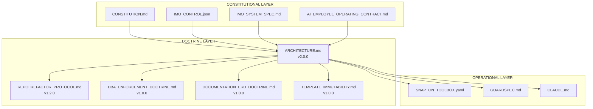
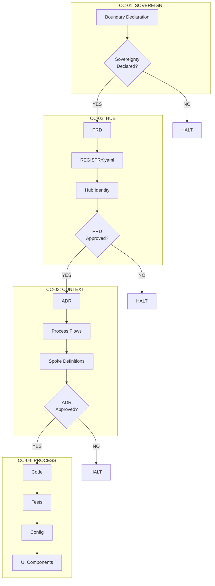
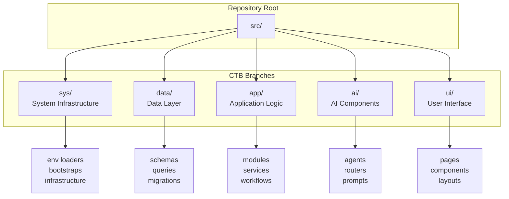
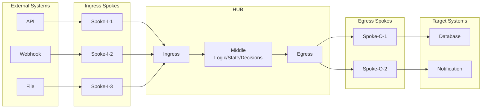
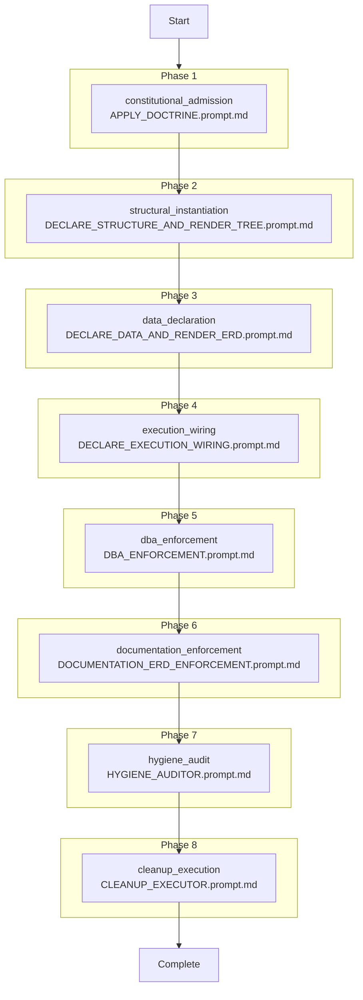
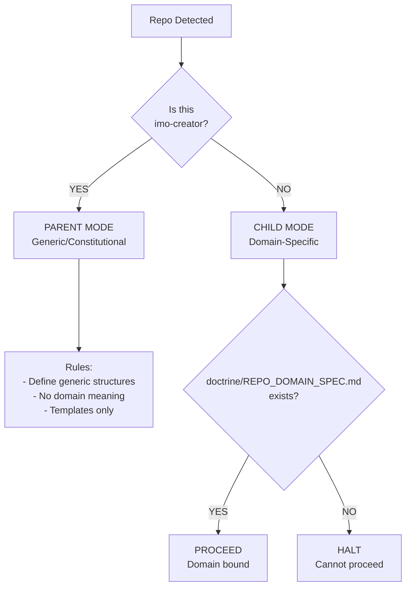

# TAS — Canonical System Diagrams

**Generated**: 2026-01-28
**Authority**: IMO-Creator (CC-01 Sovereign)
**Status**: AUTHORITATIVE

---

## 1. Authority Hierarchy Diagram

---

## 2. Canonical Chain (CC) Descent Model

---

## 3. CTB Branch Structure

---

## 4. Hub-Spoke Geometry

---

## 5. Lifecycle Phase Flow

---

## 6. Repo Mode Classification

---

## Document Control

| Field | Value |
|-------|-------|
| Created | 2026-01-28 |
| Authority | IMO-Creator (Sovereign) |
| Status | AUTHORITATIVE |
| Diagram Standard | Mermaid |
| Change Protocol | ADR + Human Approval |
