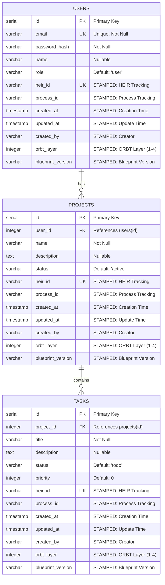

# ChartDB ERD - Database Schema Visualization

**Purpose**: Human-readable and LLM-readable Entity Relationship Diagram for the IMO Creator database schema

**Generated From**: `example_chartdb_schema.json`

**Last Updated**: 2025-10-30

---

## Database Schema Overview

This database follows the **STAMPED** (Structured Table Architecture for Managed Persistent Enterprise Data) schema pattern with CTB/HEIR/ORBT compliance.

### Database Type
- **PostgreSQL** (Neon)
- **Schema**: `public`

---

## Entity Relationship Diagram (Mermaid)



---

## Tables

### 1. USERS Table
**Barton ID**: `BART-SHQ-USERS-V1`
**Enforcement Level**: STRICT
**STAMPED Compliant**: Yes

**Purpose**: User accounts and authentication

**Columns**:
- `id` (SERIAL, PK) - Primary key identifier
- `email` (VARCHAR(255), UNIQUE, NOT NULL) - User email address
- `password_hash` (VARCHAR(255), NOT NULL) - Hashed password
- `name` (VARCHAR(255), NULLABLE) - User full name
- `role` (VARCHAR(50), DEFAULT 'user', NOT NULL) - User role
- `heir_id` (VARCHAR(50), UNIQUE, NOT NULL) - HEIR tracking ID (STAMPED)
- `process_id` (VARCHAR(50), NOT NULL) - Process tracking ID (STAMPED)
- `created_at` (TIMESTAMP, DEFAULT CURRENT_TIMESTAMP) - Creation timestamp (STAMPED)
- `updated_at` (TIMESTAMP, DEFAULT CURRENT_TIMESTAMP) - Last update timestamp (STAMPED)
- `created_by` (VARCHAR(100), NOT NULL) - Creator user/system (STAMPED)
- `orbt_layer` (INTEGER, DEFAULT 3) - ORBT layer (1-4) (STAMPED)
- `blueprint_version` (VARCHAR(20), DEFAULT '1.0') - Blueprint version (STAMPED)

**Indexes**:
- `idx_users_email` (UNIQUE) - Unique index on email
- `idx_users_heir_id` (UNIQUE) - Unique index on heir_id

**Relationships**:
- One-to-Many: `USERS` → `PROJECTS` (users can have many projects)

---

### 2. PROJECTS Table
**Barton ID**: `BART-SHQ-PROJECTS-V1`
**Enforcement Level**: STANDARD
**STAMPED Compliant**: Yes

**Purpose**: Project management and tracking

**Columns**:
- `id` (SERIAL, PK) - Primary key identifier
- `user_id` (INTEGER, FK → users.id, NOT NULL) - Foreign key to users table
- `name` (VARCHAR(255), NOT NULL) - Project name
- `description` (TEXT, NULLABLE) - Project description
- `status` (VARCHAR(50), DEFAULT 'active', NOT NULL) - Project status
- `heir_id` (VARCHAR(50), UNIQUE, NOT NULL) - HEIR tracking ID (STAMPED)
- `process_id` (VARCHAR(50), NOT NULL) - Process tracking ID (STAMPED)
- `created_at` (TIMESTAMP, DEFAULT CURRENT_TIMESTAMP) - Creation timestamp (STAMPED)
- `updated_at` (TIMESTAMP, DEFAULT CURRENT_TIMESTAMP) - Last update timestamp (STAMPED)
- `created_by` (VARCHAR(100), NOT NULL) - Creator user/system (STAMPED)
- `orbt_layer` (INTEGER, DEFAULT 3) - ORBT layer (1-4) (STAMPED)
- `blueprint_version` (VARCHAR(20), DEFAULT '1.0') - Blueprint version (STAMPED)

**Indexes**:
- `idx_projects_user_id` - Index on user_id for foreign key lookups
- `idx_projects_heir_id` (UNIQUE) - Unique index on heir_id

**Foreign Keys**:
- `fk_projects_user_id` → `users(id)` (CASCADE on DELETE/UPDATE)

**Relationships**:
- Many-to-One: `PROJECTS` → `USERS` (many projects belong to one user)
- One-to-Many: `PROJECTS` → `TASKS` (projects can have many tasks)

---

### 3. TASKS Table
**Barton ID**: `BART-SHQ-TASKS-V1`
**Enforcement Level**: STANDARD
**STAMPED Compliant**: Yes

**Purpose**: Task management within projects

**Columns**:
- `id` (SERIAL, PK) - Primary key identifier
- `project_id` (INTEGER, FK → projects.id, NOT NULL) - Foreign key to projects table
- `title` (VARCHAR(255), NOT NULL) - Task title
- `description` (TEXT, NULLABLE) - Task description
- `status` (VARCHAR(50), DEFAULT 'todo', NOT NULL) - Task status (todo, in_progress, done)
- `priority` (INTEGER, DEFAULT 0, NOT NULL) - Task priority (0-5)
- `heir_id` (VARCHAR(50), UNIQUE, NOT NULL) - HEIR tracking ID (STAMPED)
- `process_id` (VARCHAR(50), NOT NULL) - Process tracking ID (STAMPED)
- `created_at` (TIMESTAMP, DEFAULT CURRENT_TIMESTAMP) - Creation timestamp (STAMPED)
- `updated_at` (TIMESTAMP, DEFAULT CURRENT_TIMESTAMP) - Last update timestamp (STAMPED)
- `created_by` (VARCHAR(100), NOT NULL) - Creator user/system (STAMPED)
- `orbt_layer` (INTEGER, DEFAULT 3) - ORBT layer (1-4) (STAMPED)
- `blueprint_version` (VARCHAR(20), DEFAULT '1.0') - Blueprint version (STAMPED)

**Indexes**:
- `idx_tasks_project_id` - Index on project_id for foreign key lookups
- `idx_tasks_status` - Index on status for filtering
- `idx_tasks_heir_id` (UNIQUE) - Unique index on heir_id

**Foreign Keys**:
- `fk_tasks_project_id` → `projects(id)` (CASCADE on DELETE/UPDATE)

**Relationships**:
- Many-to-One: `TASKS` → `PROJECTS` (many tasks belong to one project)

---

## Relationships Summary

1. **USERS → PROJECTS** (One-to-Many)
   - One user can have many projects
   - Foreign Key: `projects.user_id` → `users.id`
   - Cascade: DELETE/UPDATE

2. **PROJECTS → TASKS** (One-to-Many)
   - One project can have many tasks
   - Foreign Key: `tasks.project_id` → `projects.id`
   - Cascade: DELETE/UPDATE

---

## STAMPED Compliance

All tables include the following STAMPED tracking fields:

- `heir_id` - HEIR tracking ID (format: `HEIR-YYYY-MM-SYSTEM-MODE-VN`)
- `process_id` - Process tracking ID (format: `PRC-SYSTEM-EPOCHTIMESTAMP`)
- `created_at` - Creation timestamp
- `updated_at` - Last update timestamp
- `created_by` - Creator user/system
- `orbt_layer` - ORBT layer (1-4)
- `blueprint_version` - Blueprint version

---

## Visualization Instructions

### Generate SVG from Mermaid

```bash
# Install Mermaid CLI
npm install -g @mermaid-js/mermaid-cli

# Generate SVG
npx mmdc -i docs/visuals/chartdb_erd.mmd -o docs/visuals/chartdb_erd.svg

# Or use the repository script
npm run gen:visuals
```

### View in Browser

1. Open the `.mmd` file in any Markdown viewer that supports Mermaid (GitHub, GitLab, VS Code with Mermaid extension)
2. Or use the online Mermaid Live Editor: https://mermaid.live/
3. Or view the generated SVG file

---

## Linked Processes

- `PRC-AUTH-LOGIN` - User authentication
- `PRC-AUTH-REGISTER` - User registration
- `PRC-PROJECT-CREATE` - Project creation
- `PRC-TASK-CREATE` - Task creation

## Linked API Endpoints

- `POST /api/auth/login`
- `POST /api/auth/register`
- `GET /api/projects`
- `POST /api/projects`
- `GET /api/tasks`
- `POST /api/tasks`

---

**Note**: This diagram is automatically generated from the ChartDB schema JSON file and can be read by both humans and LLMs for understanding the database structure.


