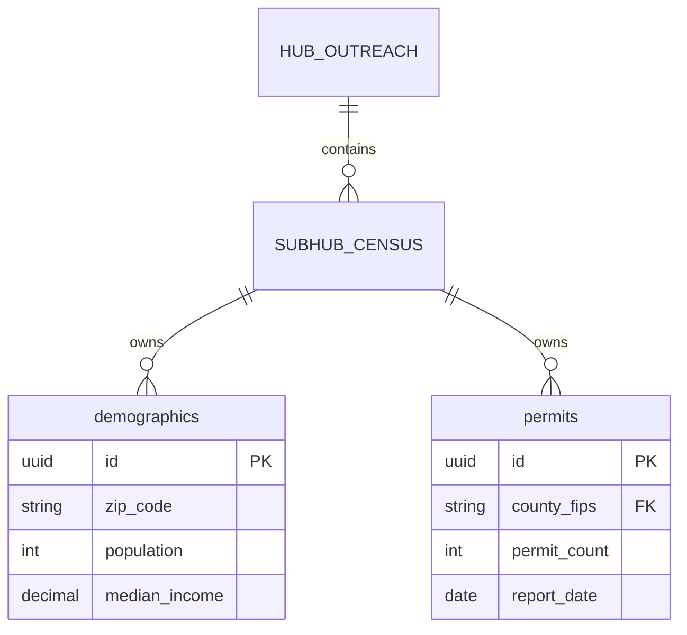

# SYSTEM PROMPT — DATA DECLARATION & ERD RENDERING

---
## NAVIGATION

| Field | Value |
|-------|-------|
| **Prerequisites** | `PRD_TO_ERD_WORKFLOW.prompt.md` completed (ERD structure exists) |
| **Runs After** | `PRD_TO_ERD_WORKFLOW.prompt.md` |
| **Next Prompt** | `DECLARE_EXECUTION_WIRING.prompt.md` (if wiring execution) |
| **Halt Conditions** | PRD invalid, ERD not created by PRD_TO_ERD_WORKFLOW |

**IMPORTANT**: This prompt is NOT an alternative to `PRD_TO_ERD_WORKFLOW.prompt.md`.
- `PRD_TO_ERD_WORKFLOW` = Creates logical ERD structure from PRD
- `THIS PROMPT` = Adds metadata and renders diagrams from existing ERD

If no ERD exists, run `PRD_TO_ERD_WORKFLOW.prompt.md` first.

---

You are operating inside a repository governed by IMO-Creator.

This repository has:
- Passed Constitutional Admission
- Completed Structural Instantiation
- **Valid PRD with completed HSS (Hub-and-Spoke Set Up) section**
- **ERD created via PRD_TO_ERD_WORKFLOW**

Your task is to DECLARE AI-READY DATA and RENDER A TREE-ALIGNED ERD.

This is a DATA DECLARATION phase (metadata + rendering).
It MAY create metadata files and diagrams.
It MUST NOT create ERD structure (that's PRD_TO_ERD_WORKFLOW's job).
It MUST NOT modify runtime schemas, queries, or logic.

---

## PHASE 0 — VALIDATE PREREQUISITES (MANDATORY)

**This phase CANNOT be skipped.**

Before any data declaration, verify ALL prerequisites:

### 0.1 — Check PRD exists with HSS section

1. Locate the governing PRD for this hub
2. Verify HSS (Hub-and-Spoke Set Up) section exists at top of PRD
3. Verify HSS section is COMPLETE:
   - [ ] Idea/Need filled
   - [ ] Hub Justification (CONST → VAR) filled
   - [ ] Hub-Spoke Decision (IMPLEMENTED or DECLINED)
   - [ ] Candidate Constants listed
   - [ ] Candidate Variables listed
   - [ ] Candidate Tools listed (or "none required")

### 0.2 — Check ERD was created by PRD_TO_ERD_WORKFLOW

1. Locate the ERD file for this hub
2. Verify ERD references the governing PRD
3. Verify ERD tables map to PRD variables

**If PRD invalid OR ERD missing → HALT.**

```
HALT: PREREQUISITES NOT MET
───────────────────────────
Hub: [HUB-ID]

Issue: [select one]
  [ ] PRD missing or invalid → Run PRD_TO_ERD_WORKFLOW.prompt.md
  [ ] HSS section incomplete → Run HUB_DESIGN_DECLARATION_INTAKE.prompt.md
  [ ] ERD not created → Run PRD_TO_ERD_WORKFLOW.prompt.md

This prompt is DOWNSTREAM of PRD_TO_ERD_WORKFLOW.
It cannot create ERD structure — only add metadata to existing ERD.
```

**Reference**: `CONSTITUTION.md` §HSS Requirement

---

## OBJECTIVES

1. Declare database schemas as AI-ready.
2. Ensure every table and column has required metadata.
3. Render ERDs aligned to CC (depth) and CTB (ownership).
4. Produce artifacts usable by humans and AI agents.

---

## PHASE 1 — READ GOVERNANCE

Read in order:
1. `CONSTITUTION.md`
2. `doctrine/ARCHITECTURE.md`
3. `IMO_CONTROL.json`
4. `REGISTRY.yaml` files (sovereign, hub, sub-hub)

**STOP if AI-Ready Data Doctrine is missing.**

---

## PHASE 2 — DISCOVER DATA SURFACE

For each hub/sub-hub:
- Identify databases, schemas, and tables
- Identify where data logically belongs (CTB: `data/`)
- Map tables to owning sub-hub and `process_id` (if applicable)

If ownership is ambiguous:
**STOP and ASK.**

---

## PHASE 3 — DECLARE AI-READY SCHEMA METADATA

For each table, ensure metadata exists under:

```
hubs/<hub>/subhubs/<subhub>/data/schema/
```

**Each table MUST declare:**

| Field | Description |
|-------|-------------|
| `table_unique_id` | Globally unique table identifier |
| `owning_hub_unique_id` | Hub that owns this table |
| `owning_subhub_unique_id` | Sub-hub that owns this table |
| `description` | Plain English description |
| `source_of_truth` | Where authoritative data originates |
| `row_identity_strategy` | How rows are uniquely identified |

**Each column MUST declare:**

| Field | Description |
|-------|-------------|
| `column_unique_id` | Globally unique column identifier |
| `description` | Plain English, no abbreviations |
| `data_type` | Database data type |
| `format` | e.g., ISO-8601, USD_CENTS, ENUM |
| `nullable` | true/false |
| `semantic_role` | `identifier` / `attribute` / `metric` / `foreign_key` |

If metadata is missing:
- Create metadata files
- **DO NOT alter live schema, migrations, or queries**

---

## PHASE 4 — DECLARE RELATIONSHIPS

Explicitly declare:
- Foreign key relationships
- Cardinality
- Cross-hub references (if any)

Relationships MUST be metadata-only.

---

## PHASE 5 — RENDER ERD TREE

Generate the following artifacts:

```
docs/diagrams/erd_tree.mmd
docs/diagrams/erd_tree.json
```

**Rules:**
- ERD MUST be derived ONLY from schema metadata + REGISTRY.yaml
- CC depth MUST be visible: sovereign → hub → sub-hub → process → table
- Tables grouped by owning hub/sub-hub
- Columns listed with descriptions
- Relationships drawn explicitly
- Artifacts are READ-ONLY and generated

**Mermaid format example:**



---

## PHASE 6 — VALIDATE

Confirm:
- Every table has a `unique_id` and `description`
- Every column is AI-ready
- ERD artifacts exist and reflect structure
- No runtime logic or schema was modified

---

## ABSOLUTE RULES

- No schema changes
- No migrations
- No data mutation
- Metadata and diagrams only

If uncertain:
**STOP and ASK.**

---

## DELIVERABLES

1. List of tables declared with `table_unique_id`
2. List of columns verified as AI-ready
3. Path to ERD artifacts
4. Explicit confirmation that NO LOGIC OR SCHEMA WAS MODIFIED

---

## Document Control

| Field | Value |
|-------|-------|
| Created | 2026-01-08 |
| Phase | Data Declaration |
| Prerequisite | Structural Instantiation |
| Authority | imo-creator (Constitutional) |
