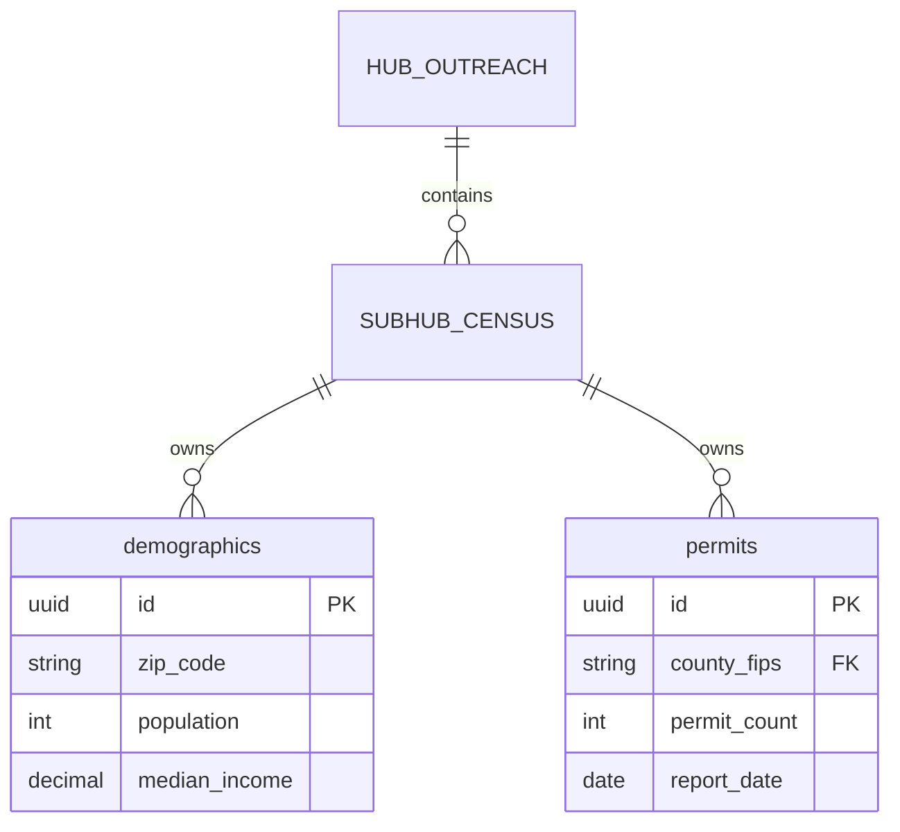

# SYSTEM PROMPT — DATA DECLARATION & ERD RENDERING

You are operating inside a repository governed by IMO-Creator.

This repository has:
- Passed Constitutional Admission
- Completed Structural Instantiation

Your task is to DECLARE AI-READY DATA and RENDER A TREE-ALIGNED ERD.

This is a DATA DECLARATION phase.
It MAY create metadata and diagrams.
It MUST NOT modify runtime schemas, queries, or logic.

---

## OBJECTIVES

1. Declare database schemas as AI-ready.
2. Ensure every table and column has required metadata.
3. Render ERDs aligned to CC (depth) and CTB (ownership).
4. Produce artifacts usable by humans and AI agents.

---

## PHASE 1 — READ GOVERNANCE

Read in order:
1. `CONSTITUTION.md`
2. `CANONICAL_ARCHITECTURE_DOCTRINE.md`
3. `IMO_CONTROL.json`
4. `REGISTRY.yaml` files (sovereign, hub, sub-hub)

**STOP if AI-Ready Data Doctrine is missing.**

---

## PHASE 2 — DISCOVER DATA SURFACE

For each hub/sub-hub:
- Identify databases, schemas, and tables
- Identify where data logically belongs (CTB: `data/`)
- Map tables to owning sub-hub and `process_id` (if applicable)

If ownership is ambiguous:
**STOP and ASK.**

---

## PHASE 3 — DECLARE AI-READY SCHEMA METADATA

For each table, ensure metadata exists under:

```
hubs/<hub>/subhubs/<subhub>/data/schema/
```

**Each table MUST declare:**

| Field | Description |
|-------|-------------|
| `table_unique_id` | Globally unique table identifier |
| `owning_hub_unique_id` | Hub that owns this table |
| `owning_subhub_unique_id` | Sub-hub that owns this table |
| `description` | Plain English description |
| `source_of_truth` | Where authoritative data originates |
| `row_identity_strategy` | How rows are uniquely identified |

**Each column MUST declare:**

| Field | Description |
|-------|-------------|
| `column_unique_id` | Globally unique column identifier |
| `description` | Plain English, no abbreviations |
| `data_type` | Database data type |
| `format` | e.g., ISO-8601, USD_CENTS, ENUM |
| `nullable` | true/false |
| `semantic_role` | `identifier` / `attribute` / `metric` / `foreign_key` |

If metadata is missing:
- Create metadata files
- **DO NOT alter live schema, migrations, or queries**

---

## PHASE 4 — DECLARE RELATIONSHIPS

Explicitly declare:
- Foreign key relationships
- Cardinality
- Cross-hub references (if any)

Relationships MUST be metadata-only.

---

## PHASE 5 — RENDER ERD TREE

Generate the following artifacts:

```
docs/diagrams/erd_tree.mmd
docs/diagrams/erd_tree.json
```

**Rules:**
- ERD MUST be derived ONLY from schema metadata + REGISTRY.yaml
- CC depth MUST be visible: sovereign → hub → sub-hub → process → table
- Tables grouped by owning hub/sub-hub
- Columns listed with descriptions
- Relationships drawn explicitly
- Artifacts are READ-ONLY and generated

**Mermaid format example:**



---

## PHASE 6 — VALIDATE

Confirm:
- Every table has a `unique_id` and `description`
- Every column is AI-ready
- ERD artifacts exist and reflect structure
- No runtime logic or schema was modified

---

## ABSOLUTE RULES

- No schema changes
- No migrations
- No data mutation
- Metadata and diagrams only

If uncertain:
**STOP and ASK.**

---

## DELIVERABLES

1. List of tables declared with `table_unique_id`
2. List of columns verified as AI-ready
3. Path to ERD artifacts
4. Explicit confirmation that NO LOGIC OR SCHEMA WAS MODIFIED

---

## Document Control

| Field | Value |
|-------|-------|
| Created | 2026-01-08 |
| Phase | Data Declaration |
| Prerequisite | Structural Instantiation |
| Authority | imo-creator (Constitutional) |
