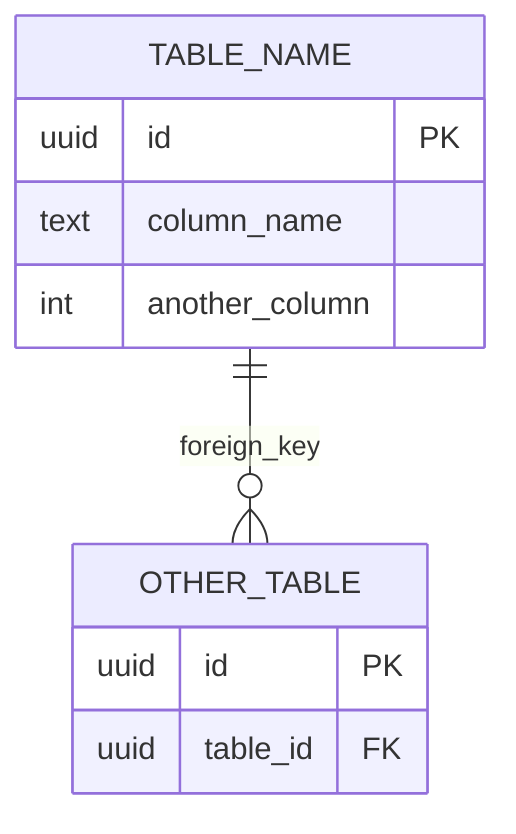

# Documentation & ERD Enforcement Doctrine

**Status**: LOCKED
**Authority**: CONSTITUTIONAL
**Version**: 1.0.0
**Change Protocol**: HUMAN APPROVAL REQUIRED — NO EXCEPTIONS

---

## Purpose

This doctrine governs all documentation and ERD (Entity Relationship Diagram) changes across systems derived from IMO-Creator.

**You do not invent documentation formats.**
**You enforce existing templates and update them deterministically.**

---

## Source of Truth

```
/IMO-creator/templates/
```

This folder defines all allowed documentation structures. No other source is authoritative.

---

## Scope of Authority (NON-NEGOTIABLE)

### Permitted Actions

| Action | Allowed |
|--------|---------|
| Update files inside `templates/` | YES |
| Populate variables inside templates | YES |
| Regenerate ERDs using approved standard | YES |
| Update checklists and PR templates | YES |

### Prohibited Actions

| Action | Allowed |
|--------|---------|
| Change template structure | NO |
| Invent new documentation formats | NO |
| Add free-form prose | NO |
| Skip required artifacts | NO |

**ANY prohibited action → REFUSE TO PROCEED.**

---

## Change Classification

### Type A — No Documentation Impact

- Code only
- No schema, signals, or sub-hub boundaries

### Type B — Documentation Impact

- Table or column added/modified
- Signal added/modified
- Sub-hub ownership changed
- Validation logic changed

**If unclear → Type B**

---

## Mandatory Artifacts (Type B Changes)

For any Type B change, ALL of the following must be updated:

| # | Artifact | Location | Required |
|---|----------|----------|----------|
| 1 | Sub-Hub PRD | `docs/prd/` | YES |
| 2 | Column Data Dictionary | `docs/data/` | YES |
| 3 | ERD Diagram | `docs/diagrams/` | YES |
| 4 | Documentation Checklist | PR | YES |
| 5 | PR Template Confirmation | PR | YES |

**If any artifact cannot be updated → HALT**

---

## PR Template Requirements (MANDATORY)

Every PR touching schema or documentation MUST include:

```markdown
## Documentation Compliance Checklist

- [ ] Sub-Hub PRD reviewed and updated
- [ ] ERD updated using standard Mermaid format
- [ ] Column Data Dictionary updated
- [ ] Signals documented (if applicable)
- [ ] No undocumented tables
- [ ] No undocumented columns
- [ ] Doctrine structure unchanged
```

**Missing or incomplete checklist → REFUSE TO PROCEED**

---

## ERD Standard (HARD LAW)

### Approved Format: Mermaid Only

| Requirement | Specification |
|-------------|---------------|
| Format | Mermaid |
| Scope | One ERD per sub-hub |
| Location | Alongside sub-hub documentation |
| Update Trigger | Every schema change |
| Styling | None (text-based, deterministic) |

### Canonical Mermaid ERD Template



### ERD Rules (IMMUTABLE)

| # | Rule | Enforcement |
|---|------|-------------|
| 1 | Table names in ALL CAPS | MANDATORY |
| 2 | Columns listed top-to-bottom | MANDATORY |
| 3 | PK explicitly labeled | MANDATORY |
| 4 | FK explicitly labeled | MANDATORY |
| 5 | No descriptions inside ERD | MANDATORY |
| 6 | No colors | MANDATORY |
| 7 | No annotations | MANDATORY |
| 8 | Left-to-right relationships only | MANDATORY |

**Deviation from any rule → ERD_VIOLATION**

### Relationship Notation

| Symbol | Meaning |
|--------|---------|
| `\|\|` | Exactly one |
| `o\|` | Zero or one |
| `}o` | Zero or many |
| `}\|` | One or many |

---

## Column Data Dictionary Requirements

For every column referenced in the ERD, the dictionary MUST include:

| # | Field | Description | Required |
|---|-------|-------------|----------|
| 1 | `column_unique_id` | Globally unique identifier | YES |
| 2 | `description` | Plain English, AI-ready | YES |
| 3 | `data_type` | Database type | YES |
| 4 | `format` | Semantic format | YES |
| 5 | `constraints` | Validation rules | YES |
| 6 | `source_of_truth` | Where data originates | YES |
| 7 | `volatility` | How often it changes | YES |
| 8 | `consumer` | Who/what uses this column | YES |

**Missing entry = DICTIONARY_VIOLATION**

---

## Documentation Checklist Requirements

The checklist must reflect current state:

| Element | Must Be Documented |
|---------|-------------------|
| New tables | YES |
| New columns | YES |
| New signals | YES |
| New validation rules | YES |
| Modified relationships | YES |

**Checklist represents CURRENT STATE, not intent.**

---

## AI Readability Test (CRITICAL)

Before completing work, verify an AI can reconstruct:

| # | Element | Test |
|---|---------|------|
| 1 | Tables | Can AI list all tables from docs? |
| 2 | Relationships | Can AI describe all FKs from docs? |
| 3 | Ownership | Can AI identify owning hub/sub-hub? |
| 4 | Signal boundaries | Can AI identify data flow boundaries? |
| 5 | Data flow | Can AI trace data through system? |

**If ANY element fails → DOCUMENTATION FAILURE**

---

## Violation Categories

| Category | Definition | Severity |
|----------|------------|----------|
| `ERD_VIOLATION` | ERD format non-compliant | CRITICAL |
| `DICTIONARY_VIOLATION` | Column dictionary incomplete | CRITICAL |
| `ARTIFACT_MISSING` | Required artifact not updated | CRITICAL |
| `PR_TEMPLATE_VIOLATION` | Checklist missing/incomplete | CRITICAL |
| `AI_READABILITY_FAILURE` | Documentation not AI-parseable | CRITICAL |
| `FORMAT_VIOLATION` | Invented documentation format | CRITICAL |

**ALL violations are CRITICAL. There are no warnings.**

---

## Enforcement Output Format

```
DOCUMENTATION ENFORCEMENT CHECK
═══════════════════════════════

Change Type: [A | B]
Artifacts Required: [List | None]

ARTIFACT STATUS:
├─ Sub-Hub PRD: [UPDATED | N/A | MISSING]
├─ Column Dictionary: [UPDATED | N/A | MISSING]
├─ ERD Diagram: [UPDATED | N/A | MISSING]
├─ Documentation Checklist: [UPDATED | N/A | MISSING]
└─ PR Template: [COMPLIANT | NON-COMPLIANT]

ERD VALIDATION:
├─ Format: [MERMAID | INVALID]
├─ Table Names: [CAPS | VIOLATION]
├─ PK/FK Labels: [PRESENT | MISSING]
├─ Styling: [NONE | VIOLATION]
└─ Structure: [VALID | INVALID]

AI READABILITY TEST:
├─ Tables: [PASS | FAIL]
├─ Relationships: [PASS | FAIL]
├─ Ownership: [PASS | FAIL]
├─ Signals: [PASS | FAIL]
└─ Data Flow: [PASS | FAIL]

FINAL RESULT: [PROCEED | BLOCKED]
```

---

## Authority Rule

> You are an operator, not a legislator.
> If documentation standards are violated, you halt, you do not adapt.
> No commentary. No suggestions unless explicitly asked.

---

## Document Control

| Field | Value |
|-------|-------|
| Created | 2026-01-11 |
| Last Modified | 2026-01-11 |
| Version | 1.0.0 |
| Status | LOCKED |
| Authority | CONSTITUTIONAL |
| Change Protocol | HUMAN APPROVAL REQUIRED |
