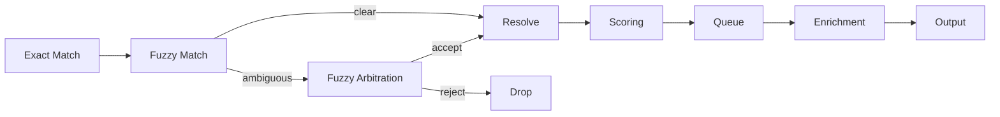

# Pipeline Flow Diagram

## Flow Description

1. **Exact Match** — Deterministic matching via code/DB constraints
2. **Fuzzy Match** — Levenshtein/Jaro-Winkler/RapidFuzz for near-matches
3. **Fuzzy Arbitration** — LLM tail only for ambiguous cases (reject allowed)
4. **Resolve** — Consolidate matched results
5. **Scoring** — BIT weighted rules engine
6. **Queue** — Enrichment queue management
7. **Enrichment** — Data enrichment pipeline
8. **Output** — Final processed results
